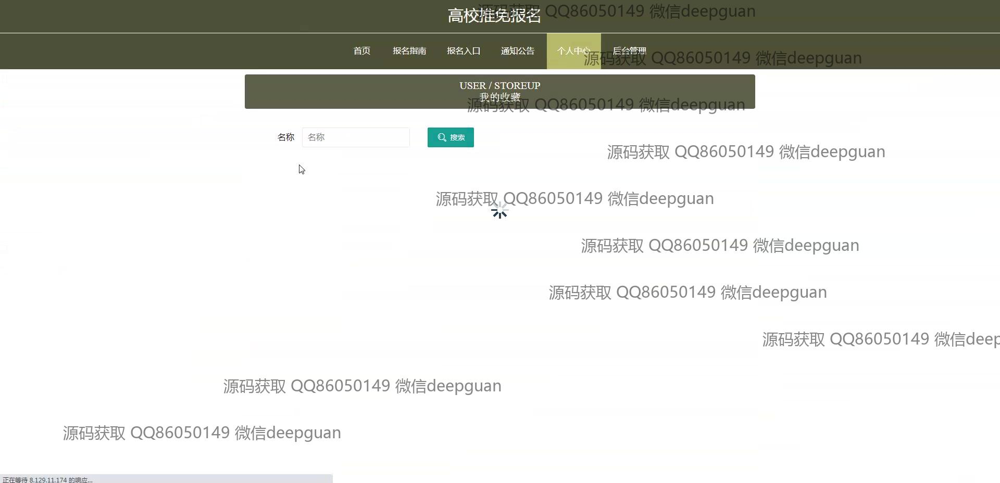

<h1 align="center">高校推免报名</h1>

## 简介
高校推免报名系统：角色分为管理员、考生；提供用户信息管理、报名审核管理、面试成绩管理、通知公告发布、专业信息管理等功能。    --计算机毕业设计源码；毕设源码；java毕业设计源码

## 联系方式

<h3 align="center">获取完整代码与数据库文件 + 微信：deepguan QQ: 86050149 QQ群: 783742310</h3>

<h3 align="center">可帮忙远程部署 包运行成功！提供远程部署、修改代码、设计文档指导、代码讲解等服务！</h3>

## 功能介绍（完整见运行截图）
管理员：基本功能包括系统的登录与管理权限设置，支持用户账号注册及信息的增删改查。网站首页设有主导航栏，方便管理员快速访问系统各主要模块。具有考生信息管理，报名信息审核，以及面试和成绩管理等功能，确保用户信息和报名流程顺利进行。个人中心提供管理员信息查看和注销功能。 用户：用户可以进行账号注册、登录和个人信息修改与查看。系统提供便捷的报名入口管理，包括填写个人基本信息和选择志愿学校及专业。具有上传证件照和相关材料的功能，以便完成报名申请。面试管理模块允许考生查看面试通知并填写面试相关信息，用户可以通过个人中心查看申请进度和参与面试详情等内容。

## 运行截图

本代码来源于网络,仅供学习参考使用!

